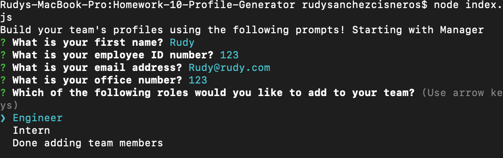

# **Profile Generator-Homework 10**

## **Description**  
-------------
A Node.js command-line application that takes information about employees on software engineering team and generates an HTML webpage with cards containing the employee information entered.

 ## **How to Use**
 ---------------
- The user would start by entering in the command line, ```npm i``` to ensure all the dependencies are installed
- The user would then be able to run test by doing ```npm test``` in the command line. This helps to keep the code maintainable
- The user would then start the application with the command ```node index.js```
- The user would then be prompted to enter the information of the team's manager. Once entered the user will have the option of entering an engineer or intern for the team. They could also select _Done adding team members_ 


- The user could then enter an engineer next. When done answering, the user can continue to add engineers, intern or select done.


- The user can enter an intern. When done answering, the user can continue to add interns, or select done

   

- When _Done adding team members_ is selected, an HTML webpage containing cards with the 
  
   

   

- Users can view all the artist who are signed up for an account on the artist page. A user can click on the cards to view their profile page. There the user can view their bio and artwork. 


- Users can get to the artwork page of any piece of art through their favorite artists' profile or through the gallery categories page. Once there, users can also leave comments for the artwork.
  


- Users would also have access to our recommendations for place to see art in person in the Recommendations page.
  


## **Built With**
---------------
- 
- 
- 
- 
- 
- 
- 
- 
## **Contributors**
--------------------
  [](https://forthebadge.com)

- Sandy M. [GitHub](https://github.com/sandra-marr)

- Allysha J. [GitHub](https://github.com/ajovich)

- Mohamed B. [GitHub](https://github.com/MohamedB-01)

- Rudy S. [GitHub](https://github.com/Rudys212)

## **License**
--------------------
-MIT License

Copyright (c) 2021 Sandy Marr

Permission is hereby granted, free of charge, to any person obtaining a copy
of this software and associated documentation files (the "Software"), to deal
in the Software without restriction, including without limitation the rights
to use, copy, modify, merge, publish, distribute, sublicense, and/or sell
copies of the Software, and to permit persons to whom the Software is
furnished to do so, subject to the following conditions:

The above copyright notice and this permission notice shall be included in all
copies or substantial portions of the Software.

THE SOFTWARE IS PROVIDED "AS IS", WITHOUT WARRANTY OF ANY KIND, EXPRESS OR
IMPLIED, INCLUDING BUT NOT LIMITED TO THE WARRANTIES OF MERCHANTABILITY,
FITNESS FOR A PARTICULAR PURPOSE AND NONINFRINGEMENT. IN NO EVENT SHALL THE
AUTHORS OR COPYRIGHT HOLDERS BE LIABLE FOR ANY CLAIM, DAMAGES OR OTHER
LIABILITY, WHETHER IN AN ACTION OF CONTRACT, TORT OR OTHERWISE, ARISING FROM,
OUT OF OR IN CONNECTION WITH THE SOFTWARE OR THE USE OR OTHER DEALINGS IN THE
SOFTWARE.


## **Links** 
---------------
- [GitHub Repo Hosted By Sandy M](https://github.com/sandra-marr/P2_All-About-That-Art)

- [Heroku Deployed Link](https://stark-badlands-81359.herokuapp.com/)